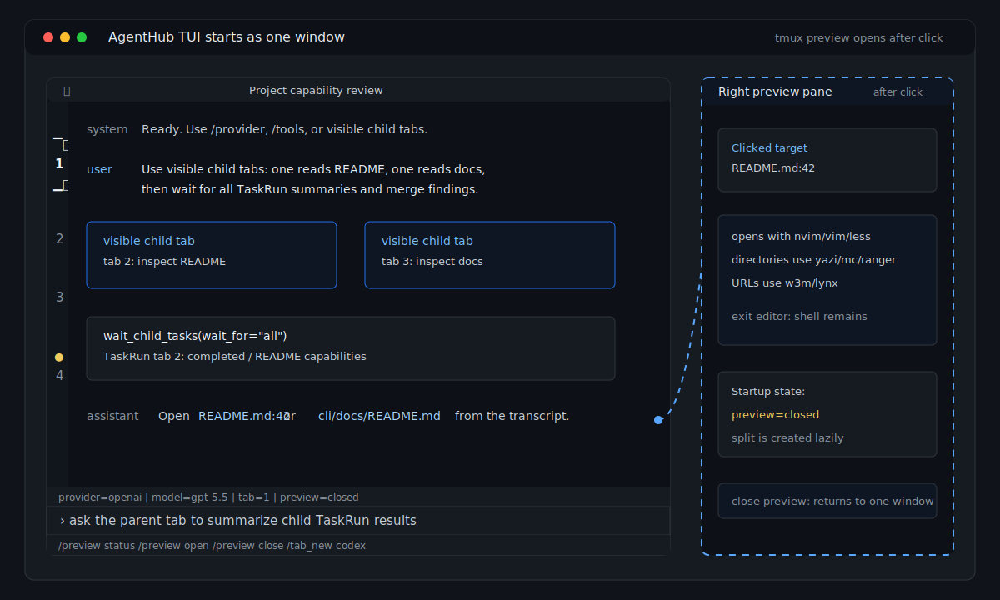

# AgentHub

AgentHub is a local-first multi-provider agent workspace for coding and
automation. It lets you use OpenAI, Anthropic, GLM, DeepSeek, and other model
providers through one CLI/TUI, with visible tool calls, approval control,
plugins, and provider switching inside the same workspace.

AgentHub is designed for engineers and AI power users who want Codex/Claude-like
agent interaction without being locked to one provider.



## Why AgentHub

- Use multiple providers from one local workspace.
- Switch providers while preserving the visible conversation and work state.
- Run in an interactive TUI or headless automation mode.
- Keep file edits, shell commands, approvals, and plugin execution under user control.
- Extend the workspace through plugins instead of hard-coding domain logic into the host.
- Package enterprise and domain workflows as separate commercial plugins when needed.

## Core Capabilities

- **Interactive TUI**: terminal UI for chat, tool calls, approvals, status, and transcripts.
- **Headless mode**: scriptable one-shot, JSON, and stream-JSON execution.
- **Provider management**: OpenAI, Anthropic, GLM, DeepSeek, and compatible provider profiles.
- **Visible context handoff**: switch models after a planning or implementation step and continue from the visible conversation, tool results, and workspace state.
- **Multi-tab orchestration**: use visible child tabs for parallel subtasks, with normalized `TaskRun` results that a parent tab can wait on and summarize.
- **Codex sidecar runtime**: OpenAI/Codex tabs can run through the bundled `codex-app-server` sidecar and reuse Codex's native tools, approvals, model catalog, and thread/fork semantics.
- **Split preview pane**: in supported terminals, AgentHub starts as a single TUI window; clicking transcript file paths, directories, `path:line` targets, or URLs opens a right-side tmux preview pane on demand.
- **Approval-aware execution**: control when commands, file edits, network access, or wider filesystem access require confirmation.
- **Plugin host**: reusable host with demo/public plugins and a boundary for commercial domain plugins.
- **Release tooling**: reproducible Linux package build, release verification, and public publish-tree filtering.

## Binary Downloads

Prebuilt CLI bundles are published on GitHub Releases:

- Latest release: <https://github.com/hoteye/AgentHub/releases/latest>
- All releases: <https://github.com/hoteye/AgentHub/releases>

Install the latest binary bundle on Linux, macOS, or WSL:

```bash
curl -fsSL https://raw.githubusercontent.com/hoteye/AgentHub/main/scripts/install_agenthub_cli.sh | bash
```

The installer resolves the latest `cli-v*` release, downloads the matching
`agenthub-cli-<version>-<platform>` archive, verifies the `.sha256` file when
available, installs the bundle under `~/.local/agenthub-cli`, and writes an
`agenthub` launcher to `~/.local/bin`. In interactive TUI mode on Linux/WSL,
that launcher detects `tmux` and prepares the split-preview layout; headless,
help, and provider-status commands run the binary directly.

Run after installation:

```bash
agenthub
```

To install a specific version:

```bash
curl -fsSL https://raw.githubusercontent.com/hoteye/AgentHub/main/scripts/install_agenthub_cli.sh | AGENTHUB_INSTALL_VERSION=cli-v0.1.4 bash
```

## 3-Minute Quickstart

Clone the repository and install dependencies:

```bash
git clone <agenthub-repo-url>
cd AgentHub
python -m pip install -r requirements.txt
python -m pip install -r cli/requirements.txt
```

Start the interactive CLI/TUI:

```bash
./cli/scripts/start_agent_cli.sh
```

Run a headless smoke command:

```bash
./cli/scripts/start_agent_cli.sh --headless --prompt "/provider" --json
```

Ask AgentHub to inspect the current project:

```text
看看这个项目的能力，并列出最适合先改进的 3 个地方
```

Exit the TUI with `/quit`, `/exit`, or double `Ctrl+C`.

## TUI Workspace

The interactive TUI is built around visible work instead of hidden background
state. A typical coding session can have several tabs open at once:

- a parent tab that plans, coordinates, or summarizes;
- child tabs that run independent subtasks and remain visible in the tab bar;
- Codex sidecar tabs backed by Codex app-server threads;
- Python-provider tabs backed by AgentHub's native provider/tool runtime.

Child tabs are normal tabs: each has its own transcript, composer, provider,
approvals, and runtime state. The parent tab should consume structured `TaskRun`
snapshots from child tabs rather than guessing completion from transcript prose.
This keeps execution state separate from task-objective claims: a child can
finish normally while still reporting that the requested objective is blocked or
only partially complete.

Example natural-language orchestration request:

```text
Use visible child tabs in parallel: one tab should inspect README, one tab
should inspect docs, then wait for all child TaskRun summaries and merge the
findings.
```

Useful tab commands:

```text
/tab_new python
/tab_new codex
/tab_new openai
/codex_threads
```

The same workflow can also be steered manually: switch to any child tab, type a
follow-up in its composer, then return to the parent tab and ask it to wait for
the latest child results.

## Codex Sidecar Runtime

For OpenAI/Codex work, AgentHub can use a bundled Codex app-server runtime:

```text
codex-app-server --listen stdio://
```

AgentHub keeps one Codex sidecar process per TUI process and maps Codex tabs to
separate Codex threads. That means multiple Codex tabs can share one runtime
process while still keeping independent conversation threads. Forking a Codex tab
uses Codex thread/fork semantics when possible; blank tabs fall back to starting
a new Codex thread.

The sidecar path is intended to stay close to native Codex behavior. AgentHub
does not reimplement Codex's model catalog, tool protocol, approval flow, or
system prompt logic for those tabs; it starts the sidecar, projects configuration
into it, maps Codex notifications back into AgentHub's transcript and status
model, and lets the TUI manage tabs, previews, and orchestration.

The Linux release bundle includes the Codex sidecar runtime resources:

- `codex-app-server`
- `path/rg`
- `codex-resources/bwrap`

## Split Preview Pane

On Linux/WSL systems with `tmux`, the installed `agenthub` launcher and the
source launcher start AgentHub as a single TUI window prepared for preview. When
you click a transcript file path, directory, `path:line` target, or URL,
AgentHub creates a right-side tmux preview pane and opens the target there:

- files and `path:line` targets open in `nvim`, `vim`, or `less`;
- directories open in a terminal file browser when available;
- URLs open in `w3m` or `lynx`;
- hover underlines the clickable token without changing the transcript text.

Preview controls:

```text
/preview status
/preview open
/preview close
/preview toggle
```

If `tmux` is unavailable, or the TUI is running headless/non-interactively, the
preview pane is skipped and the normal single-window TUI still starts. Closing
the preview pane returns to the single-window layout; clicking another target
can recreate it.

## Provider Setup

AgentHub supports provider configuration through the first-run setup flow, slash
commands, and environment variables. For a normal user install, prefer the TUI
setup flow so provider selection and credentials are stored in the user runtime
configuration instead of source directories.

Start setup:

```bash
./cli/scripts/start_agent_cli.sh
```

Then use:

```text
/setup
/provider
/model
```

OpenAI quick environment test:

```bash
export OPENAI_API_KEY="your-api-key"
./cli/scripts/start_agent_cli.sh --headless --prompt "/provider" --json
```

Anthropic quick environment test:

```bash
export ANTHROPIC_API_KEY="your-api-key"
./cli/scripts/start_agent_cli.sh --headless --prompt "/provider" --json
```

Use `/provider` before selecting a model to inspect current provider status and
availability. Provider status is informational: AgentHub should show availability
without blocking you from choosing a provider.

## Approval And Sandbox Modes

The launcher defaults to a safe daily-development profile:

```text
sandbox-mode = workspace-write
approval-policy = on-request
```

Common modes:

- `default`: read and edit inside the workspace, ask before higher-risk actions.
- `plan`: planning-focused mode where interactive user questions are allowed.
- `acceptEdits`: allow eligible workspace edits with fewer interruptions.
- `dontAsk`: reduce approval prompts for trusted local work.
- `bypassPermissions`: full-access mode for trusted environments only.

You can override approval and sandbox behavior at startup:

```bash
./cli/scripts/start_agent_cli.sh --approval-policy on-request --sandbox-mode workspace-write
./cli/scripts/start_agent_cli.sh --permission-mode bypassPermissions
```

Use full access only when the workspace and commands are trusted. It can allow
broader filesystem and network operations without prompting.

## Provider Switching With Visible Context Handoff

AgentHub can switch providers during a conversation after a model finishes a
turn. The next model receives the visible conversation, tool results, and current
workspace state, so it can continue the task with the design intent and evidence
that were already produced.

Example workflow:

```text
1. Ask Anthropic/Sonnet to plan a refactor.
2. Switch to OpenAI/GPT to implement the plan.
3. Switch to another provider or reviewer model to check the result.
```

This is a visible context handoff, not hidden reasoning transfer. Provider
internal reasoning state and private vendor session state are not portable across
providers. The reliable transfer surface is the visible transcript, tool
outputs, persisted thread state, and files in the workspace.

## Headless Automation

Run one prompt:

```bash
./cli/scripts/start_agent_cli.sh --headless --prompt "Summarize this repository"
```

Read the prompt from stdin:

```bash
printf 'List the top-level files and explain the project shape\n' \
  | ./cli/scripts/start_agent_cli.sh --headless --stdin
```

Use JSON output:

```bash
./cli/scripts/start_agent_cli.sh --headless --prompt "/provider" --json
```

Resume a persisted thread:

```bash
./cli/scripts/start_agent_cli.sh resume --last
./cli/scripts/start_agent_cli.sh --headless --resume-last --prompt "Continue the previous task"
```

## First-Run Troubleshooting

- If the TUI opens with a welcome/setup screen, complete provider setup first.
- If `/provider` shows a provider as unavailable, verify the API key and base URL outside AgentHub, then rerun `/provider`.
- If a model fails during tool use, switch to another provider and ask it to continue from the visible context.
- If a command or edit is blocked, check the current permission mode and approval policy.
- If headless runs cannot resume state, confirm you are using the same user runtime home and thread id.
- If the terminal renders incorrectly, try `PYTHONUTF8=1 PYTHONIOENCODING=utf-8 ./cli/scripts/start_agent_cli.sh`.

## Uninstall And Cleanup

For a source checkout:

```bash
rm -rf /path/to/AgentHub
```

For user runtime state, remove the AgentHub user configuration directory you
created during setup. If you used the default source launcher without a custom
runtime home, also inspect your shell environment for `AGENT_CLI_HOME` or
provider-specific runtime home overrides before deleting anything.

For generated build outputs:

```bash
rm -rf cli/build cli/dist /tmp/agenthubpublish-release
```

Do not delete provider credentials or runtime homes until you confirm they are
not shared with other local AgentHub runs.

## License

AgentHub core is licensed under Apache-2.0. See `LICENSE`.

Commercial plugins, including PSBC policy/compliance plugins, are distributed
separately under commercial terms and are not part of the Apache-2.0 core
license.
