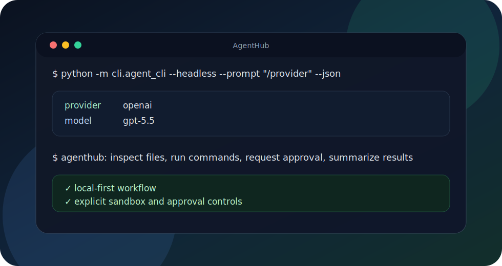

# AgentHub

Local-first multi-provider AI agent CLI.

AgentHub gives developers an interactive terminal UI and headless automation mode for
coding, shell, file, web, and approval-based workflows across multiple LLM providers.



## Features

- Interactive terminal UI
- Headless automation mode
- Multi-provider model switching
- Local tools for files, shell commands, web access, and approvals
- Provider-backed coding workflows with explicit runtime permissions

## 3-Minute Quick Start

1. Install Python 3.13.

2. Install dependencies:

```bash
python -m pip install -r requirements.txt -r cli/requirements.txt
```

3. Choose a provider with environment variables:

```bash
export AGENT_CLI_PROVIDER=openai
export AGENT_CLI_MODEL=gpt-5.5
export OPENAI_API_KEY="your-api-key"
```

For Anthropic-compatible usage:

```bash
export AGENT_CLI_PROVIDER=anthropic
export AGENT_CLI_MODEL=claude-sonnet-4-6
export ANTHROPIC_API_KEY="your-api-key"
```

4. Start AgentHub:

```bash
python -m cli.agent_cli
```

## Demos

Show provider status:

```bash
python -m cli.agent_cli --headless --prompt "/provider" --json
```

Run a headless question:

```bash
python -m cli.agent_cli --headless --prompt "Explain this repository in three bullet points."
```

Ask AgentHub to inspect and edit local files:

```bash
python -m cli.agent_cli \
  --headless \
  --sandbox-mode workspace-write \
  --approval-policy on-request \
  --prompt "Create hello_agenthub.py that prints 'hello from AgentHub', then show the diff."
```

## License

AgentHub is licensed under the Apache License 2.0. See `LICENSE`.
